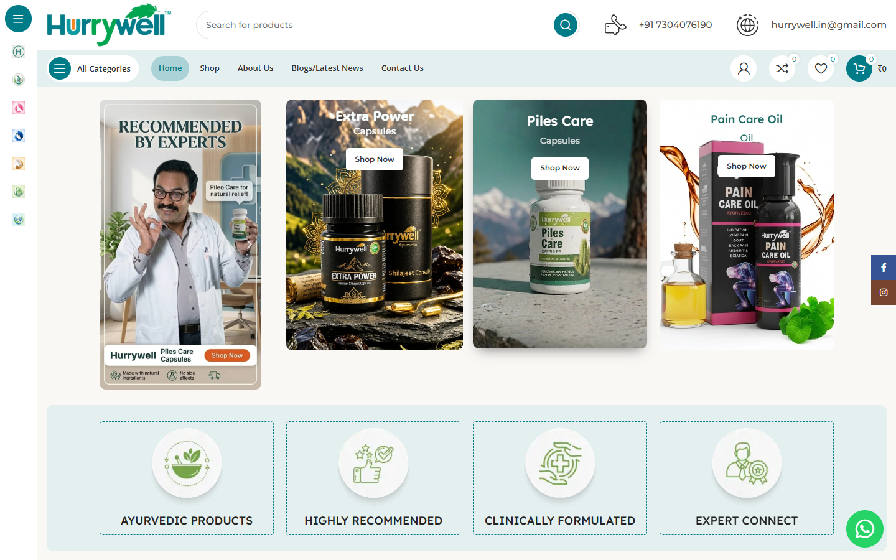

# Hurrywell Ayurvedic eCommerce

Production eCommerce website case study for Ayurvedic wellness and healthcare products.

## Overview

Hurrywell provides a responsive shopping experience covering product discovery, expert recommendations and online purchase journeys.

## Product Experience

- Category and product discovery
- Responsive eCommerce interface
- Search, account, wish-list and cart touchpoints
- Product-detail and promotional content
- Expert-led trust and conversion sections
- WhatsApp and customer-support integration

## My Contribution

Selected professional work demonstrating responsive UI implementation, eCommerce UX and business-focused front-end delivery.

## Live Website

[Visit Hurrywell](https://hurrywell.in/)

> Portfolio case study. Brand names and website content belong to their respective owners.
